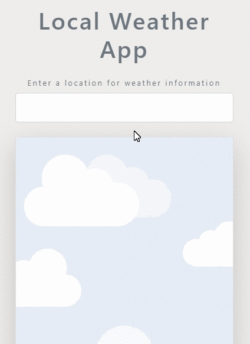
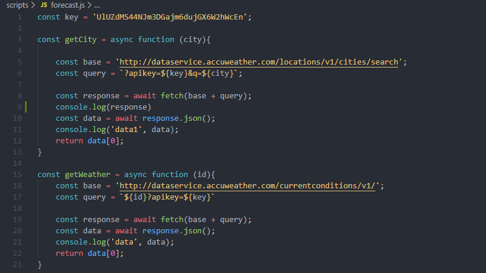

## General info
In this project I've build simple, yet fully functional weather app with Vanilla JavaScript.
I used API from https://developer.accuweather.com/
I build this app to learn and practise Asynchronous ES6 JavaScript (async/await, fetch patterns).
At the end I added local storage.  

	
## Technologies
Project is created with:
* HTML5
* CSS3
* JavaScript

## Screenshoots

	
## Setup
To run this project, clone it and open with live server:
```
$ cd to the folder where you want to download the project
$ git clone https://github.com/MakarCodes/WeatherApp.git
```
## Credits
https://developer.accuweather.com/